# Phase 03 — Relational Model and Relationship Diagram

**System:** Falchion Xeniaa Invoice Management System  
**Model version:** 1.0 · 2026-10-10  
**Schema baseline:** MySQL 8.0+ / InnoDB · UUID-shaped `CHAR(36)` IDs · `DECIMAL` for money  
**Status:** Reviewed design baseline. Migration validation is tracked separately; this diagram does not imply every API resource is already implemented.

## Entity relationship diagram

The diagram describes logical relationships, including links represented only by typed IDs in the current schema. Polymorphic links are called out below because they are not protected by a normal foreign key.

```mermaid
erDiagram
  LEGAL_ENTITIES ||--o{ INVOICES : issues
  LEGAL_ENTITIES ||--o{ INVOICE_SEQUENCES : owns
  LEGAL_ENTITIES ||--o{ QUOTATION_SEQUENCES : owns
  LEGAL_ENTITIES ||--o{ TAX_RULES : configures
  LEGAL_ENTITIES ||--o{ LEGAL_ENTITY_CONFIG_VERSIONS : versions
  LEGAL_ENTITIES ||--o{ USER_LEGAL_ENTITY_ACCESS : scopes
  LEGAL_ENTITIES ||--o{ BRAND_LEGAL_ENTITIES : maps
  BRANDS ||--o{ BRAND_LEGAL_ENTITIES : maps
  BRANDS o|--o{ INVOICES : labels
  BRANDS o|--o{ QUOTATIONS : labels
  CUSTOMERS ||--o{ INVOICES : billed
  CUSTOMERS ||--o{ QUOTATIONS : quoted
  CUSTOMERS ||--o{ PAYMENTS : makes
  INVOICES ||--|{ INVOICE_LINES : contains
  INVOICES ||--o| INVOICE_ISSUE_SNAPSHOTS : records_issue_snapshot
  INVOICES o|--o{ INVOICES : corrects_or_credits
  INVOICES ||--o{ PAYMENT_ALLOCATIONS : receives
  PAYMENTS ||--o{ PAYMENT_ALLOCATIONS : allocates
  PAYMENTS ||--o| PAYMENT_REVERSAL_EVENTS : reversal
  CATALOG_ITEMS o|--o{ INVOICE_LINES : source_reference
  TAX_RULES o|--o{ INVOICE_LINES : draft_tax_reference
  QUOTATIONS ||--|{ QUOTATION_LINES : contains
  QUOTATIONS o|--o| INVOICES : converted_to
  CATALOG_ITEMS o|--o{ QUOTATION_LINES : source_reference
  INVOICES ||--o{ REMINDER_JOBS : reminder_jobs
  APP_USERS ||--o{ AUTH_SESSIONS : owns
  APP_USERS ||--o{ ACCOUNT_INVITATION_TOKENS : receives
  APP_USERS o|--o{ SECURITY_EVENTS : actor
  APP_USERS ||--o{ USER_ROLES : has
  APP_ROLES ||--o{ USER_ROLES : assigned
  APP_ROLES ||--o{ ROLE_PERMISSIONS : contains
  APP_PERMISSIONS ||--o{ ROLE_PERMISSIONS : granted
  APP_USERS ||--o{ USER_LEGAL_ENTITY_ACCESS : scoped
  APP_USERS o|--o{ APPROVAL_REQUESTS : requests
  APP_USERS o|--o{ APPROVAL_REQUESTS : decides
  LEGAL_ENTITIES o|--o{ APPROVAL_REQUESTS : scopes
  INVOICES o|--o{ APPROVAL_REQUESTS : target_invoice
  QUOTATIONS o|--o{ APPROVAL_REQUESTS : target_quotation
  APP_USERS ||--o{ INVOICE_ISSUE_SNAPSHOTS : creates
  APP_USERS o|--o{ LEGAL_ENTITY_CONFIG_VERSIONS : changes
  APP_USERS o|--o{ TAX_RULES : approves
  APP_USERS o|--o{ DOCUMENT_FILES : creates
  APP_USERS o|--o{ EMAIL_OUTBOX : queues
  APP_USERS o|--o{ PAYMENTS : records
  APP_USERS o|--o{ PAYMENT_REVERSAL_EVENTS : reverses
  APP_USERS o|--o{ INVOICES : issues_or_cancels
  APP_USERS o|--o{ AUDIT_EVENTS : performs
```

## Table groups and ownership

| Group | Tables | Purpose |
|---|---|---|
| Company and scope | `legal_entities`, `brands`, `brand_legal_entities`, `legal_entity_config_versions`, `user_legal_entity_access` | Distinguish the issuing legal person from a brand and preserve configuration history/access scope |
| Identity/RBAC | `app_users`, `app_roles`, `app_permissions`, `user_roles`, `role_permissions` | External identity subject and explicit role/permission mappings; no production user/grant is seeded |
| Customer/catalog/tax | `customers`, `catalog_items`, `tax_rules` | Editable master data and effective-dated, entity-specific tax configuration |
| Invoicing | `invoice_sequences`, `invoices`, `invoice_lines`, `invoice_issue_snapshots` | Draft workflow, unique official numbering, document line inputs and single immutable issue-time snapshot |
| Quotations | `quotation_sequences`, `quotations`, `quotation_lines` | Separate commercial proposal lifecycle and series, with optional conversion lineage |
| Receivables | `payments`, `payment_allocations`, `payment_reversal_events` | Receipt ledger, allocations to invoices, and a separate full-reversal event |
| Workflow and delivery | `approval_requests`, `reminder_jobs`, `email_outbox`, `document_files` | Approval inbox, reminder scheduling, durable email outbox and private file metadata |
| Audit | `audit_events` | Actor/action/target/outcome and safe before/after metadata |

## Relationship and integrity rules

1. One invoice belongs to exactly one legal entity and one customer; `brand_id` is optional descriptive metadata. An invoice's supplier legal identity always comes from `legal_entity_id`, never from brand.
2. An invoice has ordered lines with a unique `(invoice_id, line_number)`. Draft line references to catalog/tax rows are source references only; issue-time values must be copied into the snapshot and remain reproducible if master data changes.
3. `invoice_issue_snapshots` has a unique `invoice_id`: one canonical issue snapshot per invoice. Its JSON must contain schema version, supplier/customer snapshots, ordered lines, tax-rule values, totals, currency/dates, number policy and calculation policy version. Hash canonical serialized JSON and verify on authorized reads/audits.
4. `invoices.related_invoice_id` links a credit/debit note to the source invoice. Service validation must require same approved issuer/compatible document policy, a valid source state, reason and amounts that comply with the finance/tax rules.
5. `payments` and `payment_allocations` are separate because a receipt may be allocated in one or more parts. Simple foreign keys do not ensure customer/currency compatibility or balance limits; those checks require transactional service logic with locked rows and integration tests.
6. `invoice_sequences` is unique by legal entity, financial year and document type after migration 003. Quotations use the separate `quotation_sequences` table.
7. `approval_requests` has typed `invoice_id` / `quotation_id` FKs in migration 003. The service must require exactly one typed target and ensure target and legal entity agree. Existing `resource_type/resource_id` remains only as a compatibility field while migration/backfill policy is reviewed.
8. `document_files` and `email_outbox` currently use `resource_type/resource_id` polymorphic references for extensibility. These columns do not have a regular FK to every possible target. The service must validate target/resource scope, and future schema work should consider typed FKs or separate link tables.
9. Audit actors now have an FK to `app_users`; null actor can be appropriate only for approved system-originated events and should be explained in the event metadata/policy. Secrets never belong in audit JSON.
10. `auth_sessions` stores SHA-256 hashes of opaque session tokens and CSRF tokens, not raw tokens. Session lookup verifies revocation/expiry/idle window/account state and loads current RBAC assignments per request.
11. `account_invitation_tokens` stores one-time token hashes and expiry/consumption/revocation state. `auth_rate_limits` stores HMAC bucket keys rather than raw email/IP/invitation values; `security_events` stores HMAC hashes for subject and source context.

## Delete/update policy

| Data | Hard delete policy | Update policy |
|---|---|---|
| Legal entity / brand / customer / catalog item / tax rule referenced historically | Restrict deletion; deactivate/archive instead | Editable master data must not change an issued snapshot; tax/config changes are effective-dated |
| Draft invoice and lines | Physical delete only if an explicit draft cleanup policy permits and no references exist; prefer audited abandonment | Editable only while DRAFT and authorized |
| Issued invoice / issue snapshot | RESTRICT; never hard-delete or cascade-delete issued evidence | Immutable financial/supplier/recipient/number fields; cancellation/correction by separately audited workflow |
| Invoice/quotation lines for issued document | RESTRICT or preserve as immutable snapshot evidence | No in-place edit after issuance |
| Receipt, allocation, reversal event | Never hard-delete a financial event | Correct via reversal/replacement with reason and audit trail |
| Approval decisions and audit events | Preserve per approved retention/legal-hold policy; no cascade from target | Append new decisions/events rather than rewriting history |
| PDF/file object metadata and email outbox | Delete only under approved retention/legal-hold policy and after dependent references are resolved | Storage key/hash/content metadata immutable after artifact finalization |
| Reminder/email attempts | Preserve attempt history per policy; jobs may be cancelled, not silently erased | State transitions are audited and retry-safe |

## Index/constraint review

- **Unique:** role/permission keys, user email and provider subject, brand code, sequence scope, invoice number scope, quotation number/sequence scope, document storage key, idempotency keys, line position within document, role/user/permission mappings.
- **Query indexes:** customer name/email; catalog name/active/type; invoice entity/date, customer and status/date; invoice related source; line catalog/tax reference; payment customer/date; allocation by invoice; reminder status/scheduled time; approval entity/status/time; email status/time; audit entity/time and actor/time; config/tax effective lookups.
- **Database constraints:** nonnegative totals/line values; positive quantity/payment/allocation; valid financial hash shape; foreign keys and explicit unique constraints.
- **Transactional-only invariants:** total allocations <= receipt amount, per-invoice allocation <= outstanding balance, payment customer/currency matches invoice, only one effective/default brand mapping where business rules require it, exact approval-target/entity matching, and invoice sequence transaction safety. These cannot be claimed enforced merely because individual foreign keys exist.

## Review issues before a production schema sign-off

- `invoices` retains mutable columns as working/read/query projections. The canonical `invoice_issue_snapshots` row must be written in the same issue transaction and must be protected from UPDATE/DELETE by database privileges (or an enforced immutable-write mechanism). The application runtime DB account should not have snapshot update/delete privileges. CI must verify this with the actual intended grant model.
- Migration 003 does not backfill snapshots for pre-existing issued invoices. Before applying it to a database that already contains issued records, inventory those rows and plan a reviewed deterministic backfill or archival exception. Do not enable issuance until every historical issued invoice has an approved snapshot treatment.
- Cross-row/temporal rules cannot all be represented with MySQL CHECK constraints. The API/domain layer must enforce them in transactions, and tests must include parallel requests, stale records and invalid cross-entity references.
- The current tables use JSON snapshots and generic polymorphic file/email targets. The payload shape, canonical hash serialization, resource type allowlist and retention rules are part of the data contract, not optional implementation details.
